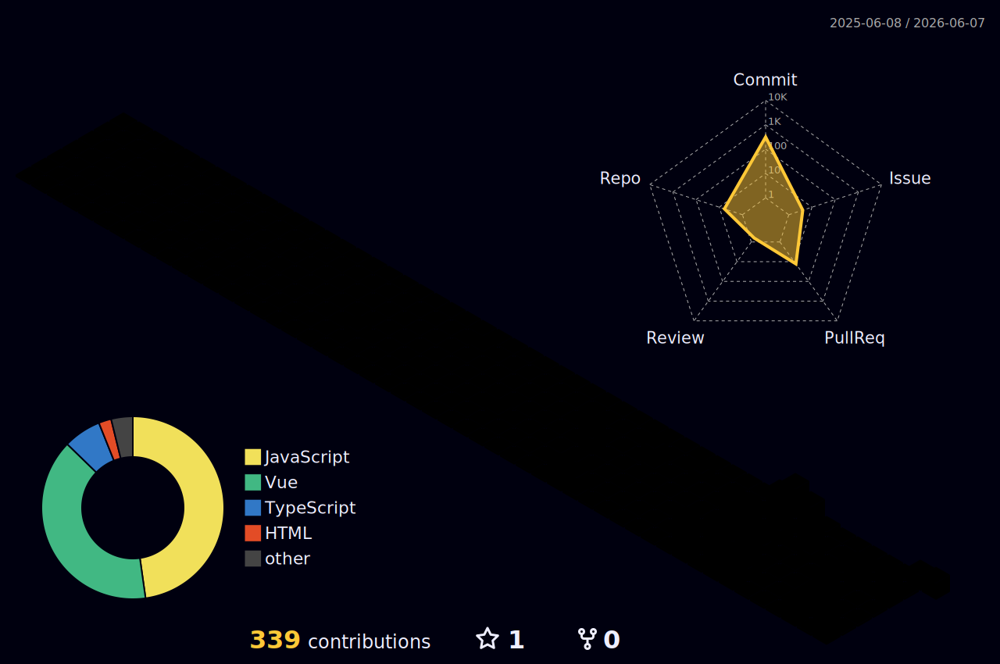

<h2>
  Hi there! 👋 I'm İsa. Welcome to my GitHub profile. &nbsp;&nbsp;&nbsp;&nbsp;&nbsp;&nbsp;&nbsp;&nbsp;&nbsp;&nbsp;&nbsp;&nbsp;&nbsp;&nbsp;&nbsp;&nbsp;&nbsp;&nbsp;&nbsp;&nbsp;&nbsp;&nbsp;
  
    
  
</h2>

<h2 align="center">👨‍💻 Who Am I</h2>

  <strong>
    Front-End Developer | React · Vue.js · Next.js | TypeScript | AI-Assisted Development
  </strong>
   
   
   

  
  
  
  

---

<h2 align="center">👨‍💻 About Me</h2>

🎯 **Building scalable, high-performance web interfaces — from enterprise banking platforms to AI-assisted developer workflows.**

💼 I'm a **Front-End Developer** with hands-on experience delivering production-grade web applications using **React, TypeScript, Vue.js, and Next.js**. My professional background spans enterprise-level banking and public sector projects, including valuation platforms used by major Turkish banks such as **Halkbank** and clients like the **Land Registry Directorate of Turkey**.

🚀 I bring a strong foundation in **component-based architecture, REST API integration, CI/CD pipelines, and Agile/Scrum delivery**. I care deeply about clean code, SOLID principles, performance optimization, and cross-functional collaboration.

🤖 I actively integrate **AI-assisted development** into my daily workflow — including **Claude Code** with CLAUDE.md-based context management, custom slash commands, and agent workflow automation — to accelerate delivery, improve code quality, and reduce repetitive overhead.

🎓 I hold a **Bachelor's Degree in Computer Education & Instructional Technology** from Uludağ University, and I'm currently pursuing an **Advanced React Certificate** from Scrimba.

🔗 View my resume: https://isabezeniroglu.vercel.app/isa_bezeniroglu_resume.pdf

<h2 align="center">🧰 Tech Stack & Tools</h2>

#### 💻 Core Technologies

`React` `TypeScript` `JavaScript (ES6+)` `Vue.js (Vue 3, Composition API)` `Next.js` `React Native` `HTML` `CSS` `SCSS` `Tailwind CSS`

#### 🧱 UI Libraries & Design

`Material UI (MUI)` `Ant Design` `Figma` `Adobe Photoshop` `Adobe Illustrator`

#### 🗂️ State Management & Architecture

`Redux` `Context API` `Advanced React Patterns` `Component Architecture` `SOLID` `OOP` `BDD` `Unit Testing`

#### 🌐 APIs & Performance

`REST APIs` `API Integration` `Performance Optimization` `Responsive Design` `Cross-Browser Compatibility`

#### ⚙️ DevOps & Tools

`Git` `GitHub` `GitLab` `GitHub Actions` `Jenkins` `CI/CD Pipelines` `SonarQube` `Docker`

#### 🤖 AI-Assisted Development

`Claude Code` `CLAUDE.md Context Management` `Custom Slash Commands` `Agent Workflow Automation` `Subagent Orchestration` `Prompt Engineering` `AI-Assisted Code Generation & Refactoring`

#### 🧪 Methodologies & Collaboration

`Agile` `Scrum` `Jira` `Confluence` `Cross-functional Collaboration`

  

---

<h2 align="center">📈 Stats</h2>

## 
 ⚡ GitHub

  
  

  
  
  

  

## 
 🌐 3D Contribution Graph

  

---

<h2 align="center">✍️ Latest Blog Posts</h2>

<!-- BLOG-POST-LIST:START -->
<!-- BLOG-POST-LIST:END -->

---

<h2 align="center">📚 Reading Journey</h2>

## 
 📖 Next on My List

  

<!-- GOODREADS-TO-READ-LIST:START -->
- [No One’s Coming: The Rogue Heroes Our Government Turns to When There’s Nowhere Else to Turn](https://www.goodreads.com/review/show/8537124642?utm_medium=api&utm_source=rss) by Kevin Hazzard (⭐️4.48)
- [Sapiens: A Brief History of Humankind](https://www.goodreads.com/review/show/8537121932?utm_medium=api&utm_source=rss) by Yuval Noah Harari (⭐️4.32)
- [Empire of AI: Dreams and Nightmares in Sam Altman's OpenAI](https://www.goodreads.com/review/show/8537120127?utm_medium=api&utm_source=rss) by Karen Hao (⭐️4.01)
<!-- GOODREADS-TO-READ-LIST:END -->

## 
 ✅ Completed Reads

<!-- GOODREADS-READ-LIST:START -->
- [Flesh](https://www.goodreads.com/review/show/8527144597?utm_medium=api&utm_source=rss) by David Szalay (⭐️3.66)
- [Conversations with Friends](https://www.goodreads.com/review/show/8527144488?utm_medium=api&utm_source=rss) by Sally Rooney (⭐️3.73)
- [Just Kids](https://www.goodreads.com/review/show/8527144373?utm_medium=api&utm_source=rss) by Patti Smith (⭐️4.21)
- [Steve Jobs](https://www.goodreads.com/review/show/8527144275?utm_medium=api&utm_source=rss) by Walter Isaacson (⭐️4.15)
- [We Did Ok, Kid: A Memoir](https://www.goodreads.com/review/show/8527144155?utm_medium=api&utm_source=rss) by Anthony Hopkins (⭐️4.05)
- [A Promised Land](https://www.goodreads.com/review/show/8527143911?utm_medium=api&utm_source=rss) by Barack Obama (⭐️4.3)
- [Elon Musk: Tesla, SpaceX, and the Quest for a Fantastic Future](https://www.goodreads.com/review/show/8527143811?utm_medium=api&utm_source=rss) by Ashlee Vance (⭐️4.1)
- [The Autobiography of Malcolm X](https://www.goodreads.com/review/show/8527143717?utm_medium=api&utm_source=rss) by Malcolm X (⭐️4.36)
- [It Chooses You](https://www.goodreads.com/review/show/8527143547?utm_medium=api&utm_source=rss) by Miranda July (⭐️4.01)
- [Anatomy for the Artist](https://www.goodreads.com/review/show/8527143446?utm_medium=api&utm_source=rss) by Sarah Simblet (⭐️4.08)
<!-- GOODREADS-READ-LIST:END -->

## 
 🔄 Currently Reading

<!-- GOODREADS-LIST:START -->
- [Mother Is Watching](https://www.goodreads.com/review/show/8537126633?utm_medium=api&utm_source=rss) by Karma Brown (⭐️3.72)
<!-- GOODREADS-LIST:END -->

---

<h2 align="center">👏 Support My Work</h2>

  If you find my work helpful or inspiring, consider buying me a coffee to show your support.

  

  

---

<h3 align="center">Let's Connect — I'm always open to collaborate and share ideas! 🚀</h3>
